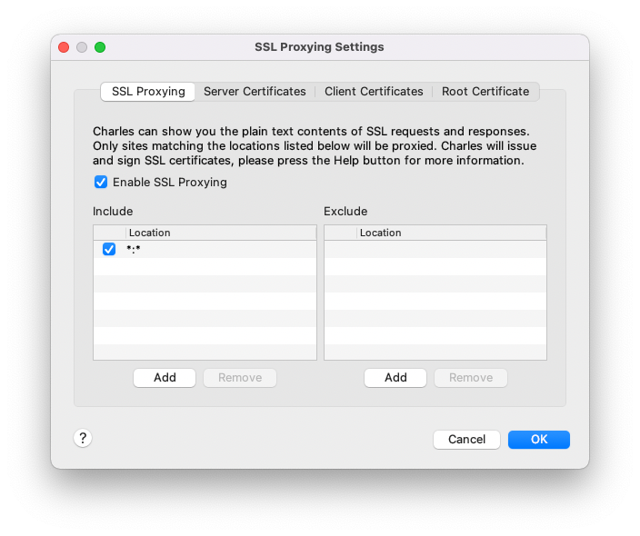

# AEM Docker Dev Setup

## Contents

1. [Prerequisites](#prerequisites)
3. [New Installation](#new-setup)
4. [Start Containers](#start-containers)
5. [Stopping and cleaning up containers](#stopping-and-cleaning-up-containers)
6. [Validating dispatcher configs](#validating-dispatcher-configs)
7. [Using Charles Proxy](#using-charles-proxy)

## Prerequisites

1. Have docker installed on your machine - [https://docs.docker.com/desktop/mac/install/](https://docs.docker.com/desktop/mac/install/)
2. Configure docker to allow 4GB+ of memory. If this is too low, you'll generally see either author or publish shutdown.
3. Make sure you have a recent AEMaaCS build zip (retrieved from
   [AEM Software Distribution Centre](https://experience.adobe.com/#/downloads/content/software-distribution/en/general.html)).
   Place the ZIP in the root of this project directory. The scripts will look for it there with the default file name it
   was called by Adobe.

## New Setup

First build local images.

```shell
./install_images.sh
```

Next edit `.env` to point to the `dispatcher/src` directory within your aem project. This image doesn't come bundled
with any dispatcher config on purpose, so you can modify your own config then restart the dispatcher container to see
the changes.

```text
DISPATCHER_CONFIG=/Users/raininglemons/IdeaProjects/my-aem-archetype-project/dispatcher/src
```

Add the self-signed SSL certificate to your keychain (by default this creates a cert for; localhost, 127.0.0.1 and
aemsite.dev)

```shell
./add_cert_to_keychain.sh
```

Finally, add the following host entry to `/etc/hosts` (just adds aemsite.dev to your host entry file)

```text
./add_hosts.sh
```

## Start Containers

Start containers with

```shell
docker-compose up -d
```

Note #1: the first run will be slow as it installs content, replication agents and initialises the repo.

Note #2: there is an issue with `docker-compose start`, so avoid this for now.

You'll be able to then access the following services:
- AEM Author: [http://localhost:4502](http://localhost:4502)
- AEM Publish: [http://localhost:4503](http://localhost:4503)
- Dispatcher: [http://localhost:8080](http://localhost:8080)
- Nginx: [http://localhost](http://localhost) or [https://localhost](https://localhost)
  - aemsite.dev: [https://aemsite.dev](https://aemsite.dev)

Replication agents are configured here:
- [Author to Publish agent](http://localhost:4502/etc/replication/agents.author/docker-publish.html)
- [Publish to Dispatcher flushing agent](http://localhost:4502/etc/replication/agents.publish/docker-dispatcher-flush.html)

Logs are mounted from the local filesystem so are accessible from `./logs`. Currently just the author, publish and
dispatcher logs are exposed.

## Stopping and cleaning up containers

Run the following command to stop and remove containers.

```shell
docker-compose down
```

Note: the repositories for both author and publisher persist to a local volume. These will be used when containers are
next started.

## Validating dispatcher configs

Ensure you have correctly configured the path to your source files in `.env`, then run;

```bash
./validate_dispatcher.sh
```

## Using Charles Proxy

To apply any changes to container proxies you need to first take them down and later bring them up, else settings won't
be applied.

```bash
docker-compose down
```

Then add proxy entries to your `~/.docker/config.json`. i.e.

```json
{
  "credsStore" : "desktop",
  "proxies":{
    "default":{
      "httpProxy": "http://host.docker.internal:8888",
      "httpsProxy": "http://host.docker.internal:8888"
    }
  }
}
```

Ensure you have the SSL proxy enabled in Charles:



Then restart your containers:

Note: Proxy only applied to author and publish. Charles CA is already installed to containers

```bash
docker-compose up -d
```

## Todo
- [ ] Improve logic to how and which dispatcher files are mounted to container
- [ ] Review the dispatcher flush agent. Without using a known serveralias, any invalidate requests get captured by
`unmatched-host-catch-all` vhost and do nothing.
- [ ] Tidy up scripts
- [ ] Review nginx config
- [ ] `docker-compose start` incorrectly wipes the repo. Need to fix, use `docker-compose up -d` instead for now